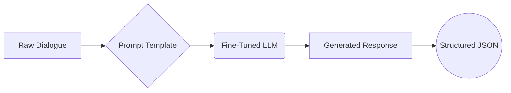
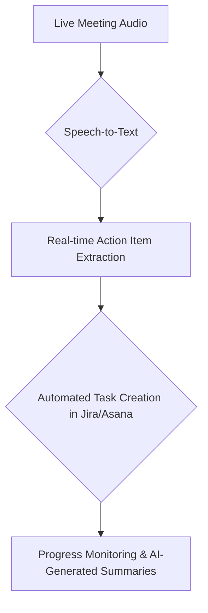

### Project Overview
Goal: Build a specialized AI model that reads meeting dialogues and extracts action items into a clean, structured JSON format.
### Value Proposition:
Transforms unstructured meeting conversations into actionable, trackable tasks.
Eliminates manual note-taking and follow-up confusion.
Demonstrates advanced NLP and structured output generation skills.

This project transforms unstructured meeting dialogues into perfectly structured, actionable tasks. By fine-tuning and comparing two powerful language models (**Mistral-7B** and **Phi-4**), this system extracts tasks, owners, and deadlines, outputting them into a clean, machine-readable JSON format.

---

### 🔍 The Problem: The High Cost of Unproductive Meetings

Every professional has felt it: meetings that end with ambiguous takeaways and tasks that fall through the cracks. This isn't just an annoyance; it's a massive drain on productivity. Key action items are often lost in messy notes or verbal-only agreements, leading to confusion, missed deadlines, and wasted resources.

**Our Solution:** An intelligent system that listens to the conversation and provides a definitive source of truth for all action items, ready for integration into any project management workflow.

---

### 🚀 Live Demo: From Chaos to Action

Give the model a raw meeting transcript...

**Input Dialogue:**
```text
#Person1#: Hey team, let's sync on the Q3 report.
#Person2#: I can take the lead on gathering the sales data. I'll have it done by Friday.
#Person1#: Great, thanks Alex. Maria, can you handle the marketing metrics?
#Person3#: Sure thing. I'll get those to you by end of day Thursday.
```

...and get a perfectly structured JSON output.

**Generated Output:**
```json
{
  "action_items": [
    {
      "owner": "Alex",
      "task": "Gather sales data for Q3 report",
      "deadline": "by Friday"
    },
    {
      "owner": "Maria",
      "task": "Provide marketing metrics for Q3",
      "deadline": "end of day Thursday"
    }
  ]
}
```
---

### 🌟 Model Showdown: Mistral 7B vs. Phi-4

A head-to-head comparison reveals a clear trade-off between raw power and nimble efficiency.

| Feature                       | 🔵 Mistral-7B (Fine-Tuned)      | 🟢 Phi-4 (Fine-Tuned)           |
| -----------------------       | ----------------------------     | ---------------------------- |
| ✅ **JSON Validity**         | **100%** (Perfectly reliable)    | 90.0% (Excellent)            |
| 🎯**F1-Score** (Accuracy)    | **0.92** (High precision)        | 0.87 (Very strong)           |
| ⏱️ **Avg. Latency** (Colab T4 GPU) | ~22.7 seconds                    | **~4.2 seconds** (5.4x faster) |
| 💾 **Adapter Size**          | ~26 MB                           | ~28-40 MB                    |
| 🏆 **Best For**              | Critical, high-stakes tasks      | Real-time, speed-sensitive applications |

**Key Takeaway**: **Mistral-7B** is the champion for accuracy and reliability. **Phi-4** is the top choice for applications where speed is paramount.

---

### 🧠 How It Works: The Technical Architecture

This project leverages state-of-the-art techniques for efficient model customization.

#### 1. Core Technology: QLoRA Fine-Tuning
Instead of training multi-billion parameter models from scratch, we use **QLoRA (Quantized Low-Rank Adaptation)**.

```python
# The key to memory efficiency
bnb_config = BitsAndBytesConfig(
    load_in_4bit=True,
    bnb_4bit_quant_type="nf4",
    bnb_4bit_compute_dtype=torch.bfloat16,
    bnb_4bit_use_double_quant=True,
)
```
This method loads the base model in 4-bit precision and only trains small, injectable "adapter" layers, reducing memory footprint by over 99% and making it possible to train on a single consumer GPU.

#### 2. Fine-Tuning Workflow
The process is simple, robust, and repeatable.



---

### 📊 Performance Deep Dive

#### 🔷 Mistral 7B: The Accuracy Powerhouse

| Training Performance | Model Footprint |
| :---: | :---: |
|  |  |
| *Loss consistently decreases, showing effective learning.* | *The adapter is a tiny 26 MB, a **99.8%** size reduction.* |

| Semantic Accuracy | Structural Integrity |
| :---: | :---: |
|  |  |
| *Achieves a top-tier **F1-Score of 0.92**.* | *Delivers **100% valid JSON** outputs.* |

---

#### 🔶 Phi-4: The Speed & Efficiency Champion

| Semantic Accuracy | Structural Integrity |
| :---: | :---: |
|  |  |
| *A strong **F1-Score of 0.87**, slightly behind Mistral.* | *Excellent **90% JSON validity**, with rare failures on complex cases.* |

| Inference Latency vs. Input Size |
| :---: |
|  |
| *Maintains low latency, with a predictable outlier on a noisy, conversational prompt (Case 5).* |

---

### 🛠️ Getting Started

Run the model yourself in just a few steps.

**1. Prerequisites**
- NVIDIA GPU with >= 8GB VRAM
- Python 3.10+
- A Hugging Face account (for downloading base models)

**2. Installation**
```bash
# Clone the repository
git clone https://github.com/your-username/your-repo-name.git
cd your-repo-name

# Create a virtual environment and install dependencies
python -m venv venv
source venv/bin/activate  # On Windows: venv\Scripts\activate
pip install -r requirements.txt
```

**`requirements.txt`**
```
torch
transformers
bitsandbytes
accelerate
peft
trl
datasets
```

**3. Run Inference**
Use the provided `inference.py` script. Update `model_name` and `adapter_path` to experiment with either model.

```python
# inference.py
from transformers import AutoModelForCausalLM, AutoTokenizer, BitsAndBytesConfig
from peft import PeftModel
import torch

# --- Configuration (Switch between models here) ---
model_name = "mistralai/Mistral-7B-v0.1"
adapter_path = "./adapters/mistral-7b-action-extractor-adapter" # UPDATE PATH

```

---

### 🔮 Future Vision & Roadmap

This project provides a strong foundation for a full-fledged productivity tool.

**Next Steps (Q4 2024):**
- 🏗️ **Deploy as API:** Wrap the model in a FastAPI service for easy integration.
- 🔄 **Expand Schema:** Add `priority` and `status` fields to the JSON output.
- 🤖 **Improve Coreference:** Better handling of pronouns (e.g., "I'll do it," "She will handle that").

**Long-Term Vision:**


---

### 🤝 How to Contribute

Contributions are welcome! Whether it's adding new dialogue data, improving model quantization, or building new integrations, your help is valued.

1.  **Fork** the repository.
2.  Create a new **feature branch**.
3.  Commit your changes and open a **Pull Request** with a detailed description.

---
